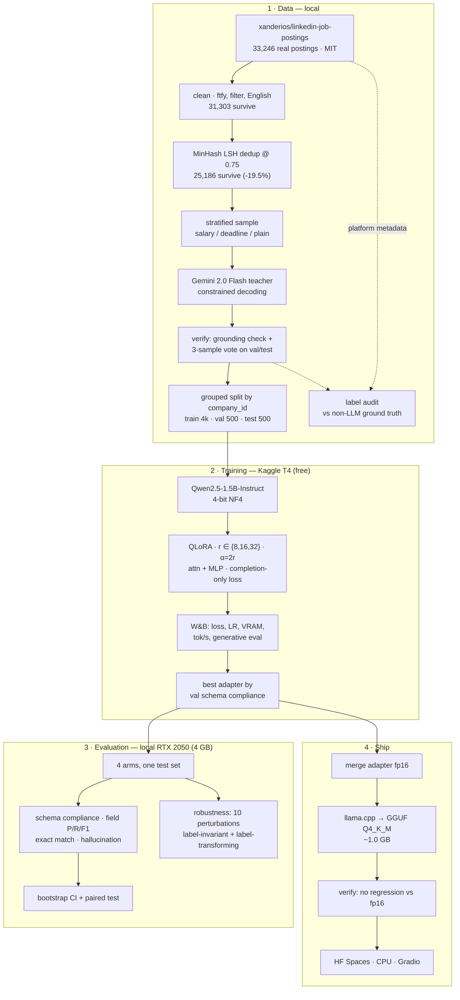

# structured-extract

**A 1.5B model that turns messy job postings into validated JSON — LoRA fine-tuned on a free Kaggle T4, quantized to a 1 GB file, and evaluated against its own base model and a frontier ceiling on a sacred held-out test set.**

[](https://github.com/2005-Aneeshdutt/structured-extract/actions/workflows/ci.yml)
· [Live demo](https://huggingface.co/spaces/aneeshdutt/structured-extract-demo)
· [Adapter](https://huggingface.co/aneeshdutt/qwen2.5-1.5b-jobs-extract)
· [GGUF](https://huggingface.co/aneeshdutt/qwen2.5-1.5b-jobs-extract-GGUF)
· [Dataset](https://huggingface.co/datasets/aneeshdutt/structured-extract-jobs)

> **Status: pipeline complete, training run pending.** Every script in this repo
> runs; the results tables below are populated by `make compare report` once the
> Kaggle run finishes. Numbers are left as `—` rather than filled with plausible
> placeholders — a results table you cannot reproduce is worse than no table.

---

## Results

<!-- BEGIN RESULTS -->

Held-out test split, n = 500. Identical prompt template, greedy decoding and
token budget for every arm — see [`data/schema.py`](data/schema.py), which is the
single definition all four arms import.

| Metric | Base 0-shot | Base 3-shot | **LoRA r=16 (ours)** | Gemini 2.0 Flash |
|---|---:|---:|---:|---:|
| Schema compliance (strict) | — | — | **—** | — |
| Schema compliance (lenient) | — | — | **—** | — |
| Field F1 (micro) | — | — | **—** | — |
| Exact match (all 18 leaf fields) | — | — | **—** | — |
| Hallucination rate ↓ | — | — | **—** | — |
| Over-emission rate ↓ | — | — | **—** | — |
| Null recall | — | — | **—** | — |
| Mean latency / example | — | — | **—** | — |

Full table with 95% bootstrap confidence intervals, per-field breakdown and a
paired significance test: [`results/comparison_table.md`](results/comparison_table.md).

<picture>
  <source media="(prefers-color-scheme: dark)" srcset="results/charts/model_comparison_dark.png">
  
</picture>

<!-- END RESULTS -->

---

## Architecture



---

## Why these choices

### Why job postings

Three domains were considered. Job postings won on both axes that matter:

| | clean free data | eval story |
|---|---|---|
| **Job postings** ✅ | 33k real postings, MIT licensed, no auth — **and the platform's own structured fields** (`min_salary`, `pay_period`, `formatted_work_type`, `formatted_experience_level`, `remote_allowed`) | rich difficulty gradient in one document; salary normalization is genuinely hard; "did you make this up?" is checkable |
| Product listings | plentiful, but the structure is *already* in the metadata | extraction is close to trivial; no normalization challenge; weak story |
| Financial filings | SEC EDGAR is free | documents are 100k+ tokens — hopeless for a 1.5B at 2k context; correctness needs domain expertise to judge |

The decisive factor is the third column of row one. **10 of the 18 scored leaf
fields have independent, non-LLM ground truth** from LinkedIn's own form fields.
That is what turns "an LLM labeled my data, trust me" into a measurable claim —
see [`results/label_audit.md`](results/label_audit.md).

### Why distillation is a legitimate pattern, not a shortcut

No free dataset carries JSON extraction labels for job postings, so labels come
from Gemini 2.0 Flash. The objection to expect in an interview is *"you just
trained on another model's output."* Three responses:

1. **A teacher is a labeling function, and this one is verified.** Legitimacy
   comes from verification, not provenance. Every label passes constrained
   decoding (structurally valid by construction), pydantic validation, a
   **grounding check** that every extractive value has a supporting span in the
   source, and — for val/test — a 3-sample self-consistency vote. Failures are
   dropped, not repaired into agreement, and the funnel is reported.
2. **The economics are the entire point.** Gemini Flash at 100M postings/month is
   a recurring bill, a network hop, a rate limit and a vendor dependency. A 1.5B
   LoRA is a one-time training cost, runs in-VPC, and serves from a 1 GB file on
   CPU. Distillation converts per-call cost into fixed cost — which is why real
   extraction pipelines end up here.
3. **The inputs are real.** Only the labels are model-generated. Fully synthetic
   *text* would be a closed loop: the same model invents the posting and the
   answer, always in the same phrasing, and the student learns the teacher's
   writing style instead of the task.

**The honest caveat, stated in the results table too:** Gemini also produced the
gold labels, so its column is biased upward. The gap-closing figures are
therefore *conservative*. The label audit against LinkedIn's non-LLM metadata is
what makes that quantifiable rather than hand-waved.

### Why Qwen2.5-**1.5B-Instruct**

- **1.5B** is the smallest size that reliably holds a two-level JSON structure
  while fitting a 3-epoch QLoRA run in one Kaggle session and quantizing to ~1 GB
  — small enough to serve on free CPU, which is what makes the demo exist.
- **Instruct, not base.** The headline claim is a lift over the base model. A
  non-instruct baseline would score near zero on an instruction-shaped task and
  the "lift" would be an artifact of comparing against a model never taught to
  follow instructions. Starting from Instruct makes the baseline as strong as it
  honestly can be, so the gain is attributable to task specialization.
- Qwen2.5 has strong JSON/structured-output behavior out of the box and an
  Apache-2.0 license.

### Why this schema

12 top-level fields flattening to 18 scored leaves, spread across four
deliberately different difficulty tiers:

| Tier | Fields | What it tests |
|---|---|---|
| 1 · verbatim | `job_title`, `company_name` | near-copy extraction |
| 2 · nested | `location.{city,region,country,remote_policy}` | two-level structure without dropping a brace |
| 3 · closed-vocab & sets | `employment_type`, `seniority_level`, `education_requirement`, `required_skills`, `preferred_skills`, `benefits` | classification into a fixed vocabulary; set-valued extraction; **required vs preferred** section reasoning |
| 4 · normalize & abstain | `salary.{min,max,currency,period}`, `years_experience_min`, `application_deadline` | `"$120k–$150k/yr"` → `120000/150000/USD/yearly`; and **null-over-guess**, which is where base models fail hardest |

Closed enums are used wherever possible so per-field accuracy is exact rather
than a function of a fuzzy-match threshold — an unfalsifiable knob is the fastest
way to lose credibility in an interview.

### Why these hyperparameters

Every value is defended inline in [`training/train.py`](training/train.py). The
ones most likely to be probed:

| Choice | Reason |
|---|---|
| `alpha = 2 × rank` | keeps effective LoRA scaling fixed at 2.0 across the ablation. Otherwise rank changes capacity *and* effective LR at once, and the ablation measures nothing. |
| attention **and** MLP targets | the task is mostly learning an output convention, and convention knowledge lives in the MLP blocks. ~2.5× adapter params; negligible VRAM at these ranks. |
| `fp16`, never `bf16` | T4 is Turing (sm_75) — no bfloat16 tensor cores. The script asserts this instead of failing 20 minutes in. |
| `max_grad_norm=0.3` | fp16 loss-scaler over-correction causes spike-then-NaN runs on Turing. Tight clipping is free insurance. |
| `packing=False` | packing would let one example's tokens attend to the previous example's. For a task whose premise is "extract only from *this* document" that is a correctness risk, not just a metrics risk. |
| completion-only loss | trains on the assistant turn only. Without it, most of the gradient budget goes to reproducing the schema card and the posting. |
| effective batch 16 (2 × 8) | largest that fits at seq 2048 in 4-bit on a T4; activation memory is the binding constraint, not compute. |
| seq len 2048 / 6000 chars | measured: p50 = 3,481 chars, p90 = 6,521, p95 = 7,567. A 6,000-char cap leaves **86.1%** of postings untruncated and pins the sequence under 2,048 tokens. |

### Why LoRA rank *r*

Filled from [`results/ablation_table.md`](results/ablation_table.md) after the
sweep. The conclusion to write is not "the biggest number wins" — it is whether
the difference exceeds the bootstrap interval. If r=8 is inside r=32's CI, the
correct call is that the task does not need the capacity, and the smaller adapter
ships.

---

## Evaluation design

The part that makes or breaks credibility. Five commitments:

1. **The test set is sacred.** Written once by `prepare_dataset.py`, with its ids
   recorded in `data/processed/test_ids.txt` and committed, so "we never touched
   it" is checkable rather than asserted. Model selection, quantization checks
   and every iteration use the validation split.
2. **Deduplicate *before* splitting.** Large employers post the same requisition
   across 40 cities; Jaccard similarity on 5-word shingles between two such
   postings is 0.95+. Near-dup removal ran at threshold 0.75 and dropped **19.5%
   of the corpus** (3,056 exact + 3,061 near duplicates). Splitting first would
   have put near-identical postings on both sides and quietly turned the headline
   numbers into memorization. The split is additionally **grouped by
   `company_id`** and the residual leakage is *measured* and reported in
   `results/dataset_stats.md`.
3. **Null-aware P/R/F1, not accuracy.** Most fields are null most of the time.
   Accuracy on `application_deadline` is ~97% for a model that always emits null.
   Nulls are treated as "no prediction", so the majority-class shortcut scores
   zero — the honest outcome. There is a unit test asserting exactly this.
4. **Bootstrap CIs resampled at the example level.** Resampling fields would
   treat 18 fields of one posting as independent observations; they are not (a
   parse failure fails all 18 at once), and the intervals would come out ~√18
   times too narrow. The base-vs-fine-tuned comparison also gets a **paired**
   bootstrap test, because overlapping CIs do not imply non-significance.
5. **Hallucination is defined, not vibed.** One function,
   `schema.ungrounded_fields`, defines "unsupported by the source". The same
   function filters teacher labels, computes the metric, and drives the warning in
   the demo — so all three cannot disagree.

### Robustness suite

Ten perturbations, each a deterministic function of a test example that *also*
determines the correct label — so a metric drop is brittleness, never label noise.

- *Label-invariant*: whitespace chaos, ALL CAPS, HTML residue, mojibake, +1.2 KB
  of EEO boilerplate, character transpositions (gold tokens protected).
- *Label-transforming*: delete the salary sentence → gold salary becomes null;
  delete the deadline sentence → gold deadline becomes null. **These are the
  interesting ones** — they measure whether the model stops asserting a value
  once its evidence is removed, which is exactly what separates a fine-tuned
  extractor from a base model pattern-matching "job posting → emit a salary".

Zero API calls, zero human labeling. → [`results/robustness.md`](results/)

---

## Reproduce from scratch

```bash
git clone https://github.com/2005-Aneeshdutt/structured-extract
cd structured-extract
python -m venv .venv && source .venv/bin/activate     # Python 3.11+
pip install -r requirements.txt
# torch: install the CUDA build for your driver FIRST, e.g.
#   pip install torch --index-url https://download.pytorch.org/whl/cu121

make test          # 44 unit tests, no GPU or network needed
make smoke         # full data pipeline on 120 postings with a mock teacher, no API key
```

**1 · Data** — two phases, in order, one teacher throughout. Free Gemini tier:
~7,750 calls at 1,500/day ≈ **5 days of wall clock**. Both phases are cached and
resumable, so this is a background chore: re-run the target each day after the
quota resets and it continues where it stopped, at zero cost for work already
done.

```bash
cp project.env.example .env && $EDITOR .env    # GOOGLE_API_KEY, HF_USER
export $(grep -v '^#' .env | xargs)

make label-gold    # phase 1: 1,250 postings x 3 samples, self-consistency voted
make label-bulk    # phase 2: 4,000 postings x 1 sample, --exclude-from phase 1
make prepare       # dedup-aware grouped split; voted labels fill val/test first
```

Phase order is not optional. Phase 2 draws a larger corpus slice that *contains*
phase 1's, and `--exclude-from` is what stops the overlap being labeled twice —
which would burn quota and put duplicate ids into the splitter.

Why one teacher for both phases: a cheaper model for the bulk pass would halve
the wall clock, but the student would be trained toward one model's conventions
and graded against another's. That train/test label mismatch is not worth two
days.

**2 · Train + quantize** — both on Kaggle. Full copy-paste runbook with timing
and failure modes: **[`training/KAGGLE.md`](training/KAGGLE.md)**.

```python
!python training/train.py --config training/configs/rank16.json \
    --dataset-path data/processed/hf --hub-model-id <HF_USER>/qwen2.5-1.5b-jobs-extract
!apt-get -qq install -y cmake
!bash quantize/merge_and_quantize.sh outputs/qwen2.5-1.5b-r16-a32/adapter models/
```

Merging happens on Kaggle rather than locally because it peaks near 7 GB of
system RAM — too close to the line on a 16 GB laptop where WSL2 gets ~7.9 GB by
default. Kaggle has 30 GB and builds llama.cpp cleanly; you download a ~1 GB
GGUF instead of fighting a memory ceiling.

**3 · Evaluate** (local, 4 GB VRAM is enough — everything is 4-bit or GGUF):

```bash
make eval-all eval-ablation robustness
make compare report              # writes results/*.md and results/charts/*.png
make verify                      # GGUF vs fp16-adapter regression check
```

Generation is batched with length-sorted bucketing. Measured on an RTX 2050
(4 GB): **41 s/example unbatched → 7.7 s at batch 8 → 6.1 s at batch 16**, which
is the difference between ~17 GPU-hours for the full evaluation and ~3. Batch 8
is the default because it leaves headroom for a batch of unusually long
postings; `--batch-size 16` measured fine on 4 GB and is worth trying.

Left padding is set explicitly for batched decoding — with right padding a
decoder-only model continues from pad tokens and emits fluent nonsense, with
nothing in the output to reveal why.

**4 · Ship**:

```bash
make app                         # Gradio locally; see app/README.md for the Space
```

---

## Repository layout

```
structured-extract/
├── data/
│   ├── schema.py              # THE contract: 12 fields, enums, prompts, grounding check
│   ├── corpus.py              # fetch · clean · dedup (MinHash LSH) · stratify
│   ├── generate_synthetic.py  # Gemini teacher, self-consistency, platform audit
│   └── prepare_dataset.py     # quality filter · grouped split · SFT format · HF export
├── training/
│   ├── train.py               # self-contained Kaggle QLoRA script + custom callbacks
│   ├── KAGGLE.md              # copy-paste runbook: train → merge → quantize → push
│   └── configs/               # rank8 / rank16 / rank32 — one variable at a time
├── eval/
│   ├── metrics.py             # comparators, null-aware P/R/F1, bootstrap CI
│   ├── charts.py              # CVD-validated palette, light + dark PNGs
│   ├── run_eval.py            # HF / GGUF / Gemini backends behind one interface
│   ├── compare_models.py      # comparison table + paired significance test
│   ├── robustness_test.py     # 10 perturbations with derived gold labels
│   └── generate_report.py     # charts, ablation table, failure analysis
├── quantize/
│   ├── merge_and_quantize.sh  # fp16 merge → GGUF → Q4_K_M
│   └── verify_quantized.py    # measured regression check, not an assumption
├── app/app.py                 # Gradio demo, CPU GGUF, model A/B toggle
├── results/                   # tables, charts, audits (committed — they are the point)
└── tests/                     # 44 tests pinning schema + metric behavior
```

> `data/corpus.py` is an addition to the originally sketched three-file data
> layout: fetch/clean/dedup is a genuinely separate concern from teacher
> labeling, and merging them produced one 700-line module doing two jobs.

---

## Failure analysis

Generated by `make report` into
[`results/failure_analysis.md`](results/failure_analysis.md): 10 worked examples
sampled *one per failure category* rather than the first 10 (which would just
re-describe the aggregate table), across a seven-category taxonomy —
`unparseable`, `salary_misparse`, `over_emission`, `missed_extraction`,
`enum_confusion`, `set_partial`, `ungrounded`.

The analysis to write once numbers exist: which category dominates, and whether
the fix is more data, a schema change, or constrained decoding. If `unparseable`
dominates, GBNF grammar-constrained decoding in llama.cpp removes it outright and
is a better answer than more training.

---

## Known limitations

Stated here rather than waiting to be found:

- **Test labels come from the teacher.** The Gemini ceiling column is biased
  upward; gap-closed figures are conservative. Mitigated, not eliminated, by the
  3-sample vote on held-out labels and the platform-metadata audit.
- **`application_deadline` has thin support.** Only 313 postings in the entire
  25,186-posting corpus carry a date-shaped deadline, so ~30 land in the test
  split and its F1 interval is wide. Its real diagnostic value is on the negative
  class (~470 test postings where the answer is null and base models invent a
  date), which has ample support.
- **Enriched distribution.** Salary-bearing postings are oversampled from 38% to
  40% and deadline-bearing ones as far as availability allows. Reported per-field
  F1 is conditional on this mix, not an estimate of wild-distribution
  performance. Train/val/test all draw from the same mix, so the model-vs-model
  comparison — the actual claim — holds.
- **English, US-centric, 2023–24 LinkedIn.** Non-English postings are filtered
  out; currency handling beyond USD/GBP/EUR/INR is untested.
- **Single seed per rank.** Run-to-run variance on val metrics is ~1pp; the
  ablation does not average over seeds.

---

## License

Code: Apache-2.0. Source corpus: MIT
([xanderios/linkedin-job-postings](https://huggingface.co/datasets/xanderios/linkedin-job-postings)).
Base model: Apache-2.0 (Qwen2.5).
